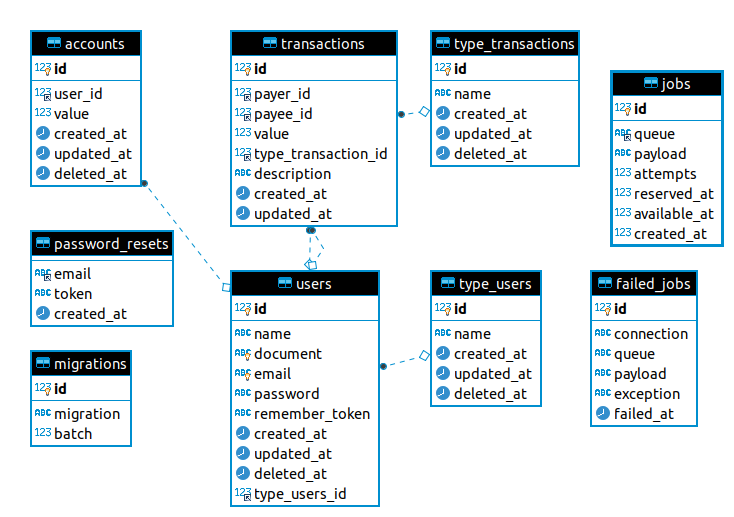

# Transfer
#### Descrição
Serviço REST API para cadastro de usuários - clientes e lojas, onde clientes possam realizar transações de valores entre conta e lojas apenas receber estes valores.

#### Tecnologias e serviços
Abaixo as tecnologias utilizadas no projeto.
- Laravel (PHP)
- Banco de dados (MySQL)
- Banco de dados chave/valor (Redis)

#### Instruções instalação
```php
git clone
composer install
php artisan migrate
php artisan db:seed
```

#### Métodos
Abaixo o padrão de requisições para consumir serviços.

#### Modelagem



- **Accounts:** contas de usuários
- **Failed_jobs:** registros de jobs falhadas para serem reprocessadas
- **Jobs:** registros de jobs asyncronas (Notificações)
- **Migrations:** laravel config
- **Password_resets:** laravel config
- **Users:** registros de usuários: cliente e lojas
- **Transactions:** registro de transações entre cliente e cliente/lojas
- **Type_transactions:** tipos de transações (Default 1: seed)
- **Type_users:** tipos de usuários (Default 1 e 2: seed)

###### Registrar usuários
```bash
# Endpoint
[POST] /api/user/register

# Payload
{
    "name": "João Teste ",
    "document": "634.489.640-00", #Documento - CPF para clientes / CNPJ para lojas
    "email": "email_2@email.com",
    "password": "123456"
}

# Response
Status: 200
Body:
{
    "success": true,
    "messages": {
        "name": "João Teste",
        "email": "email_2@email.com",
        "document": "63448964000",
        "type_users_id": 1,
        "updated_at": "2020-08-25 00:16:21",
        "created_at": "2020-08-25 00:16:21",
        "id": 1,
        "account": {
            "value": 0,
            "user_id": 1,
            "updated_at": "2020-08-25 00:16:21",
            "created_at": "2020-08-25 00:16:21",
            "id": 1
        }
    }
}
```

------------

###### Transações
```bash
# Endpoint
[POST] /api/transaction
[POST] /transaction

# Payload
{
    "value" : 100, #númerico
    "payer" : 2,
    "payee" : 3
}

# Response
Status: 200
Body:
{
    "success": true,
    "messages": "Transação efetuada com sucesso."
}
```

------------

###### Buscar usuários
```bash
# Endpoint
[GET] /api/user/{user_id}

# Response
Status: 200
{
    "success": true,
    "messages": [
        {
            "id": 1,
            "name": "João Teste",
            "document": "63448964000",
            "email": "email_2@email.com",
            "created_at": "2020-08-25 00:16:21",
            "updated_at": "2020-08-25 00:16:21",
            "deleted_at": null,
            "type_users_id": 1,
            "account": {
                "id": 1,
                "user_id": 1,
                "value": "0.00",
                "created_at": "2020-08-25 00:16:21",
                "updated_at": "2020-08-25 00:16:21",
                "deleted_at": null
            }
        }
    ]
}
```